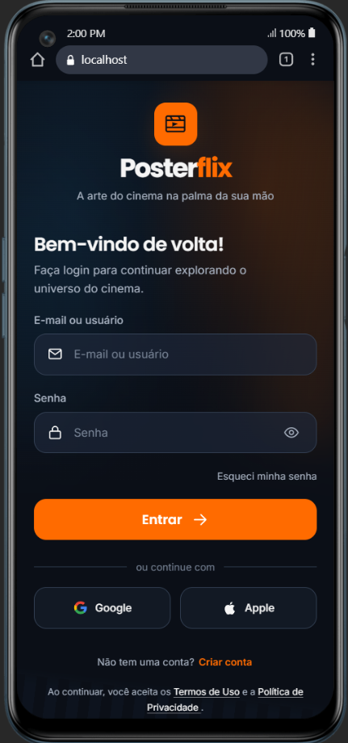
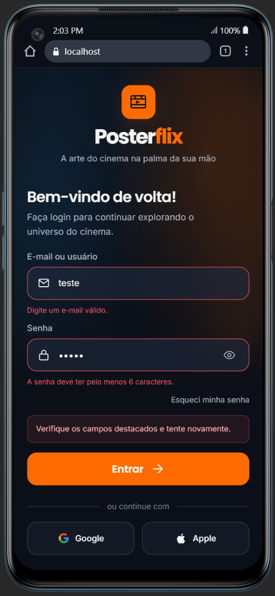
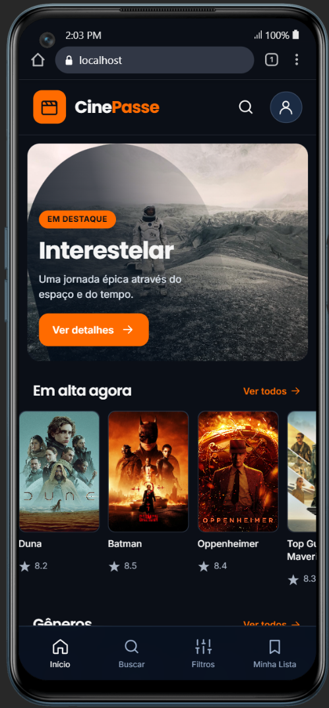
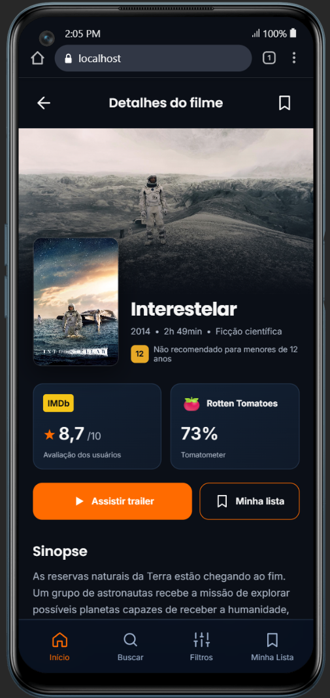
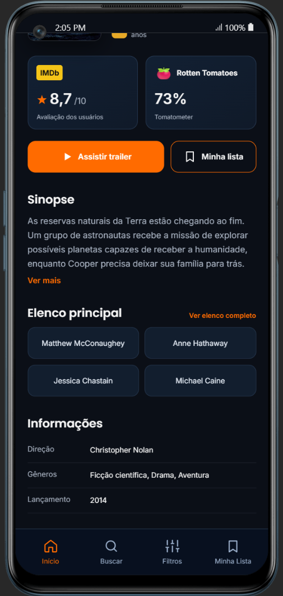
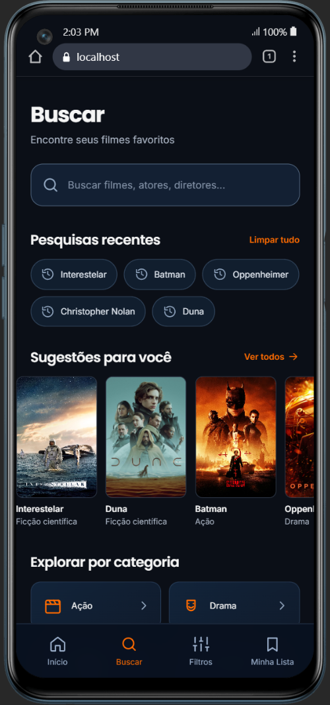
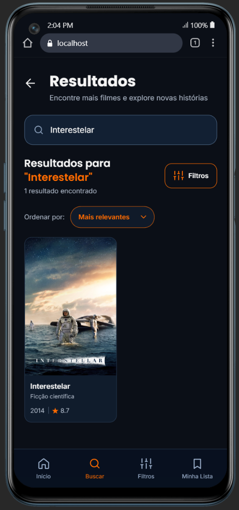
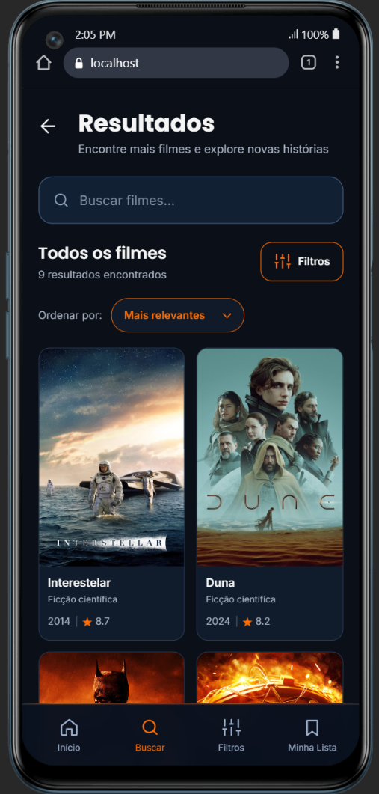
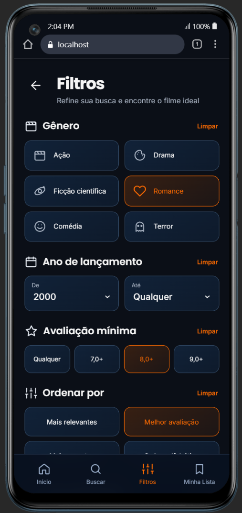

# 🎬 CinePasse

<p align="center">
  Uma experiência moderna e responsiva para descobrir e explorar filmes.
</p>

<p align="center">
  <strong>Projeto acadêmico desenvolvido com HTML, CSS, JavaScript e Vite.</strong>
</p>

---

## 📖 Sobre o projeto

O **CinePasse** é uma aplicação web desenvolvida com foco na descoberta e exploração de filmes.

O projeto apresenta uma interface moderna e responsiva, permitindo navegar por filmes em destaque, realizar buscas, visualizar resultados, aplicar filtros e consultar informações detalhadas sobre um filme.

O CinePasse foi desenvolvido como projeto acadêmico, colocando em prática conceitos de desenvolvimento Front-End, organização de código, responsividade e experiência do usuário.

## ✨ Funcionalidades

- 🏠 Página inicial com filmes em destaque
- 🔎 Busca de filmes por título e gênero
- 🎞️ Exibição de resultados da pesquisa
- 🎚️ Filtros para refinar a busca
- ↕️ Ordenação por avaliação, ano e título
- ⭐ Exibição de avaliações dos filmes
- 🎬 Página com informações detalhadas de filme
- 📱 Interface responsiva para diferentes tamanhos de tela

---

## 🖼️ Interfaces

### 🔐 Login

<table>
  <tr>
    <td align="center"><strong>Login</strong></td>
    <td align="center"><strong>Validação de erro</strong></td>
  </tr>
  <tr>
    <td align="center">
      
    </td>
    <td align="center">
      
    </td>
  </tr>
</table>

### 🏠 Início

<p align="center">
  
</p>

### 🎬 Detalhes do filme

<table>
  <tr>
    <td align="center"><strong>Informações principais</strong></td>
    <td align="center"><strong>Sinopse e informações</strong></td>
  </tr>
  <tr>
    <td align="center">
      
    </td>
    <td align="center">
      
    </td>
  </tr>
</table>

### 🔎 Busca

<p align="center">
  
</p>

### 🎞️ Resultados

<table>
  <tr>
    <td align="center"><strong>Resultado da busca</strong></td>
    <td align="center"><strong>Todos os filmes</strong></td>
  </tr>
  <tr>
    <td align="center">
      
    </td>
    <td align="center">
      
    </td>
  </tr>
</table>

### 🎚️ Filtros

<p align="center">
  
</p>

---

## 🛠️ Tecnologias utilizadas

- HTML5
- CSS3
- JavaScript
- Vite
- Git
- GitHub

---

## 📂 Estrutura do projeto

```text
cinepasse/
├── docs/
│   └── screenshots/
├── public/
│   └── images/
├── src/
│   ├── css/
│   ├── js/
│   └── views/
├── .gitignore
├── index.html
├── package.json
├── package-lock.json
└── README.md
```

---

## 🚀 Projeto online

O **CinePasse está disponível online** através do Render.

> 🔗 Acesse o projeto pelo link disponível na seção **About** deste repositório.

---

## 💻 Executando o projeto localmente

### 1. Clone o repositório

```bash
git clone https://github.com/RChagaz/cinepasse.git
```

### 2. Entre na pasta do projeto

```bash
cd cinepasse
```

### 3. Instale as dependências

```bash
npm install
```

### 4. Inicie o servidor de desenvolvimento

```bash
npm run dev
```

Depois, acesse no navegador o endereço exibido pelo Vite no terminal.

---

## 🎓 Contexto acadêmico

Projeto desenvolvido para fins acadêmicos, com o objetivo de aplicar conhecimentos de desenvolvimento web Front-End na construção de uma aplicação organizada, responsiva e de fácil utilização.

---

<p align="center">
  🎬 <strong>CinePasse</strong> — encontre sua próxima história.
</p>
